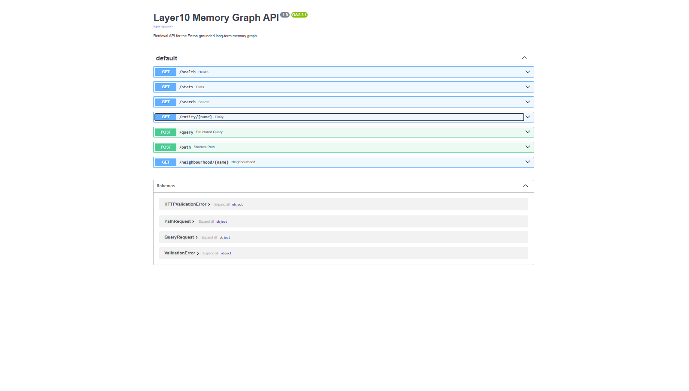
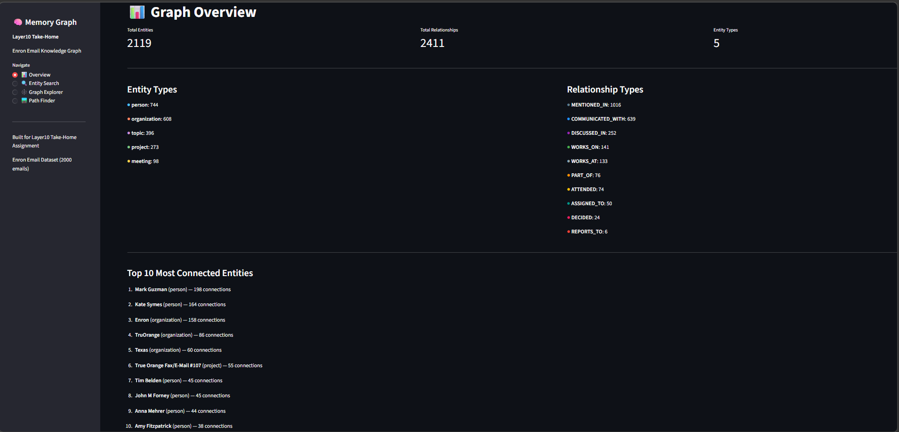
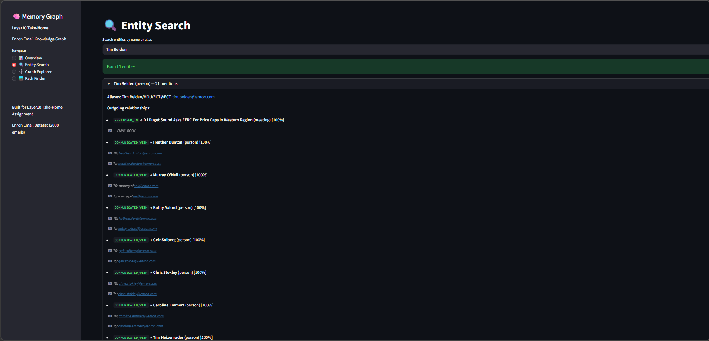
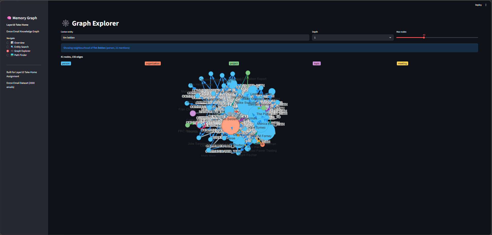
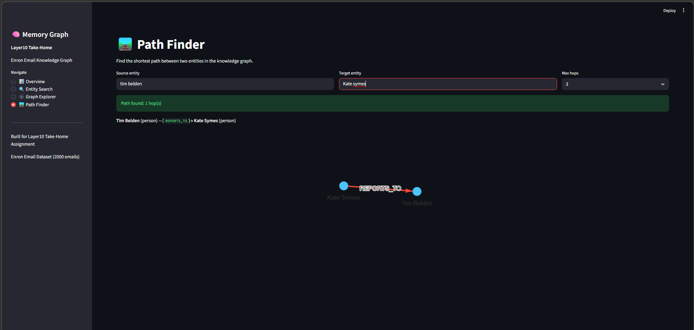
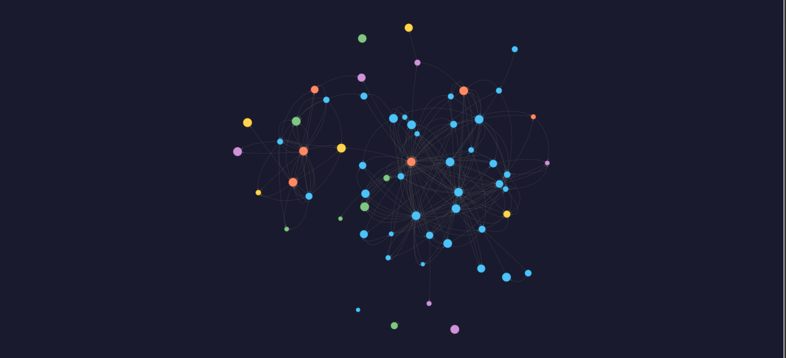
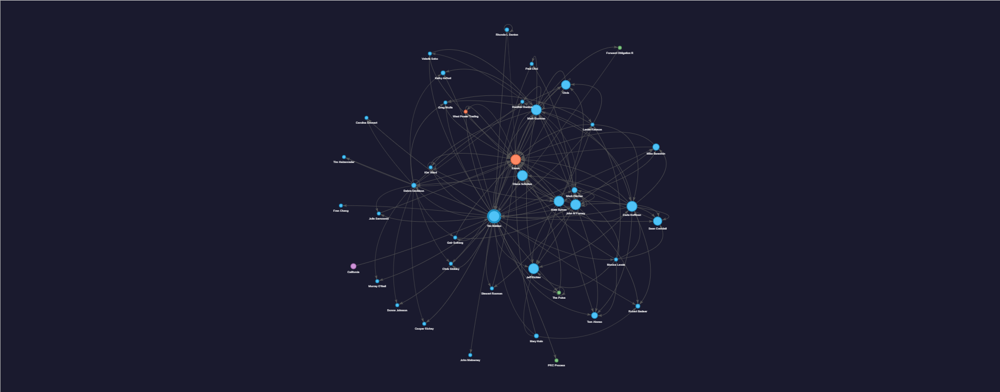
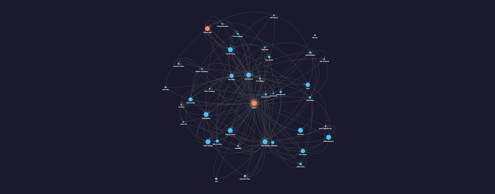
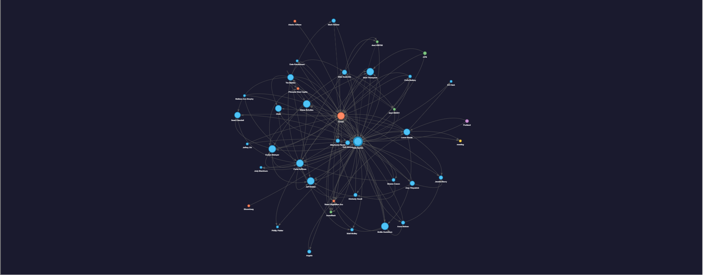
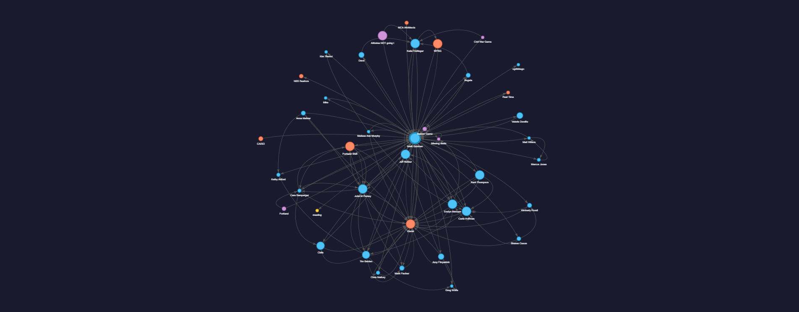

# Grounded Long-Term Memory via Structured Extraction

**Layer10 Take-Home Assignment**

A system that extracts structured knowledge from the Enron Email Dataset (2,000 emails),
deduplicates entities via a 3-pass resolution pipeline, builds a Neo4j knowledge graph,
and provides retrieval APIs with interactive visualization.

## Project Structure

```
├── config.py                  # Central configuration (.env loader)
├── schema.py                  # Ontology definitions (Pydantic models)
├── run_pipeline.py            # Run extraction → dedup → graph in sequence
├── run_api.py                 # Start FastAPI server
├── run_viz.py                 # Start Streamlit app
├── requirements.txt
├── .env.example
│
├── pipeline/
│   ├── extraction.py          # LLM-based structured extraction (parallel + checkpointing)
│   ├── dedup.py               # 3-pass entity dedup + claim consolidation
│   └── graph_builder.py       # Neo4j graph ingestion
│
├── api/
│   └── retrieval_api.py       # FastAPI REST API (7 endpoints)
│
├── viz/
│   ├── viz_app.py             # Streamlit interactive graph explorer (4 pages)
│   └── generate_static_viz.py # Pyvis standalone HTML generation
│
├── scripts/
│   ├── eda_enron.py           # Exploratory data analysis
│   └── select_subset.py       # Dataset subset selection
│
├── Screenshots/               # UI screenshots
│
├── data/
│   └── enron_subset.csv       # 2,000-email subset (5.4 MB)
│
└── output/
    ├── deduped_graph.json     # Serialized unified graph (2.5 MB)
    ├── graph_stats.json       # Graph statistics
    ├── context_packs/         # 5 example context packs (JSON)
    ├── visualizations/        # 5 static HTML graph visualizations
    └── extractions/           # 670 per-email JSON extraction files
```

## Quick Start

### Prerequisites

- Python 3.10+
- Docker (for Neo4j)
- An OpenRouter API key (or alternative: Groq, Gemini, local Ollama)

### 1. Setup

```bash
git clone <repo-url> && cd LayerAI
python -m venv venv && source venv/bin/activate
pip install -r requirements.txt
cp .env.example .env   # Edit with your API keys
```

### 2. Start Neo4j

```bash
docker run -d --name neo4j-memory \
  -p 7474:7474 -p 7687:7687 \
  -e NEO4J_AUTH=neo4j/layer10memory \
  neo4j:5-community
```

### 3. Run the Full Pipeline

```bash
python run_pipeline.py
# Or run stages individually:
#   python -m pipeline.extraction
#   python -m pipeline.dedup
#   python -m pipeline.graph_builder
```

### 4. Launch Services

```bash
# FastAPI at http://localhost:8000
python run_api.py

# Streamlit at http://localhost:8501
python run_viz.py

# Generate static HTML visualizations
python -m viz.generate_static_viz
```

## Pipeline Overview

| Stage | Module | Description |
|-------|--------|-------------|
| 1. Extract | `pipeline/extraction.py` | LLM-based structured extraction (Llama 3.1 8B via OpenRouter, 10 parallel workers, body-hash dedup) |
| 2. Dedup | `pipeline/dedup.py` | 3-pass entity resolution (exact → alias → fuzzy via rapidfuzz) + claim consolidation |
| 3. Graph | `pipeline/graph_builder.py` | Neo4j ingestion with UNWIND batching + indexes |
| 4. API | `api/retrieval_api.py` | FastAPI REST API — search, entity lookup, neighbourhood, shortest path |
| 5. Viz | `viz/viz_app.py` | Streamlit interactive explorer — overview, search, graph, path finder |

## API Endpoints

| Endpoint | Method | Description |
|----------|--------|-------------|
| `/health` | GET | Liveness check |
| `/stats` | GET | Graph-level statistics |
| `/search?q=...&limit=10` | GET | Fuzzy entity search |
| `/entity/{name}` | GET | Entity detail + relationships |
| `/neighbourhood/{name}?depth=2` | GET | k-hop subgraph |
| `/query` | POST | Structured graph query (by claim type) |
| `/path` | POST | Shortest path between two entities |

## Example Context Packs

Pre-generated context packs in `output/context_packs/`:

| Pack | Query | Size |
|------|-------|------|
| `pack_1_tim_belden.json` | Entity lookup: Tim Belden | 13.6 KB |
| `pack_2_belden_symes_path.json` | Shortest path: Tim Belden ↔ Kate Symes | 62.3 KB |
| `pack_3_decisions.json` | All DECIDED claims | 4.5 KB |
| `pack_4_enron_org.json` | Enron entity + 2-hop neighbourhood | 101.3 KB |
| `pack_5_reporting_structure.json` | All REPORTS_TO claims | 1.2 KB |

## Results

| Metric | Value |
|--------|-------|
| Emails processed | 670/671 (99.9%) |
| Unique email bodies | 671 (from 2,000 rows) |
| Raw entities / claims | 5,905 / 4,292 |
| Deduplicated entities | 2,119 (64% reduction) |
| Consolidated claims | 2,411 (44% reduction) |
| Entity types | 5 (person, organization, project, topic, meeting) |
| Relationship types | 10 active (12 defined) |
| Most connected entity | Mark Guzman (198 connections) |
| Extraction time | ~35 minutes |

## Screenshots

### FastAPI Retrieval API



### Streamlit Graph Explorer

| Overview | Entity Search |
|----------|---------------|
|  |  |

| Graph Explorer | Path Finder |
|----------------|-------------|
|  |  |

### Static Pyvis Visualizations

| Full Graph (60 entities) | Tim Belden |
|--------------------------|------------|
|  |  |

| Enron Organization | Kate Symes |
|--------------------|------------|
|  |  |

| Mark Guzman (most connected) |
|------------------------------|
|  |

## Deliverables

- **Serialized graph**: `output/deduped_graph.json`
- **Example context packs**: `output/context_packs/` (5 packs)
- **Runnable visualization**: Streamlit app + 5 static HTML files
- **Design write-up**: [WRITEUP.md](WRITEUP.md)
- **Reproducibility**: This README + `requirements.txt` + `.env.example`

See [WRITEUP.md](WRITEUP.md) for the full design document.
